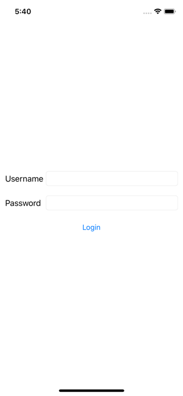
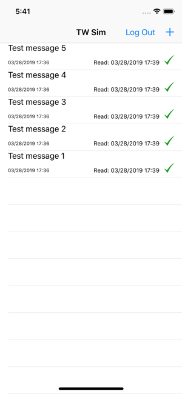

# TWSimulator
The purpose of this project is to demonstrate my coding capabilities by creating a stand-alone Twitter-like client.  There are no RESTful JSON API calls involved.  All data is stored in JSON format in the Documents directory of the phone.

The goals of the project are:
* Allow a single user to log in and log out.
* Display a list of Tweets
* Allow a logged in user to post a new Tweet
* Append the new Tweet to the list of current Tweets
* On launch, if the user is logged in, display the list of Tweets
* On launch, if the user is not logged in, display the login screen

There are a few questions to answer:
* If you are querying a real web service (RESTful API), is it guaranteed to respond immediately?
 *  No.  There are quite a few things that may go wrong.  We are only in control of the App development itself.  When communicating with external services, there are quite a few things to consider.  These things include:
    * Network connection: Before and during network calls, you must consider the status of the network.  We may use the Apple tool called `Reachability` to determine if there is a network connection to the internet.  There are also other CocoaPods, such as `NetworkManager`, to perform the network reachability tests.
    * Target server responses.  We, as the App creators, do not have full control over the responsiveness of the API servers.  To counter this problem, we would add timeouts and error management to the calls.  If the server is not responding, or if it stops responding to the request, we must act accordingly.  Acting accordingly may be as simple as notification to the user that there is a problem and how to respond to the problem.  It is **important** to keep the user up-to-date with any problems and issues the App is encountering.
    * Slow server responses.  Even if we have a close relationship with the maintainer of the API server, there may be times where the server is slower in responding.  This could be due to the server itself or the communication between the phone and the server.  There are many things in the path that can go wrong.  This means that we **must** display some indicator to the user when we are making network calls.  By Apple standards, as long as the little network indicator in the status bar passes their requirements for user notification of network activity.  Personally I prefer to provide the user with an indicator that shows network activity clearly.  
* Are users always able to log in?
  * The simple answer is yes - if the user has the correct username and password. Once the RESTful API integration is complete then the answer is "Only when there is network connectivity".

## Usage Notes

To run this project, clone the repository and:
* Change the development team to your team.
* Run the command "pod install" from the base directory.  If you do not have CocoaPods installed, refer to the [CocoaPods Installation Directions](https://guides.cocoapods.org/using/getting-started.html).
* Open the workspace file (TWSimulator.xcworkspace) with XCode.
* For testing, the username to use is `mike` and the password is `mike`

## General Notes
Although I did not use RXSwift in this project, there are a few places it would prove useful when integrating the RESTful API.  These are:
* When changing the datasource, for example adding new Tweets or updating Tweets.
* When network connectivity changes

The design of this project is using MVP structure.  You will note the View Controllers, Models and Controllers.

Please review the full comments in the code.  I have explained and commented as my normal development processes.

## Screenshots
| Login screen | Main Tweet screen | New Tweet screen |
| --- | --- | --- |
|  |  |  |
